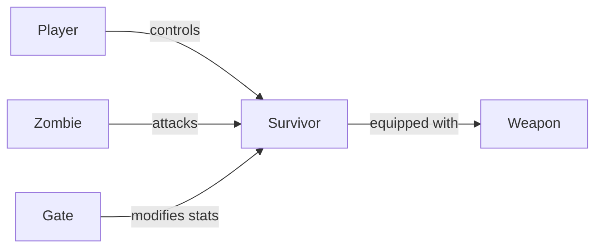

# Module 1: Modeling

> *"OOP is about modeling the real world in your code."*

Học OOP qua việc tạo các objects thực tế trong game.

---

## 🎮 Game Context: Last z: Survival Shooter

Module này sử dụng scenario **Survival Shooter Game** — game sinh tồn bắn zombie kiểu *Vampire Survivors*, *Last War*.

### Game tham khảo

**Platform: Mobile**

[Last Z: Survival Shooter - Vid 1](../../RESOURCES.md#game-context--references)
[Last Z: Survival Shooter - Vid 2](../../RESOURCES.md#game-context--references)

### Core Gameplay

```
🎮 Di chuyển (trái phải) → 🔫 Tự động bắn → 🚪 Qua Gate tăng stats → 💀 Clear Zombies!
```

### Relationship diagram



| Component | Responsibility |
|-----------|----------------|
| **Player** | Input (AD) |
| **Survivor** | Movement + State (health, speed, fireRate) |
| **Weapon** | Auto-fire logic (damage, bulletCount) |
| **Zombie** | Chase + Attack AI |

> [!TIP]
> Trong Survival Shooter, **Weapon tự động bắn** về phía trước. Player chỉ cần focus di chuyển giữa hai làn, đưa ra lựa chọn.

---

## Tại sao bắt đầu từ Modeling?

Trong game dev, **mọi thứ đều là objects**:
- Survivor, Zombie, Weapon, Bullet
- UI elements, Audio sources
- Level data, Save files

**Game Programming Patterns** nói:

> *"The game loop will call `update()` on every object every frame."*

Hiểu cách tạo objects đúng cách là **nền tảng của mọi thứ**.

---

## Khái niệm cốt lõi

| Khái niệm | Ý nghĩa thực tế | Ví dụ |
|-----------|-----------------|-------|
| Class | Model một khái niệm thực | `Survivor` là blueprint của nhân vật |
| Object | Instance cụ thể | `player1`, `bossZombie` |
| Encapsulation | Bảo vệ state, chỉ expose cần thiết | `private health` + `public TakeDamage()` |
| Method | Behavior của object | `Fire()`, `Move()` |

---

## Các Task

Làm theo thứ tự:

1. [Task: Survivor](./Task_Survivor.md) — Tạo nhân vật với state cơ bản *(Encapsulation)*
2. [Task: Player](./Task_Player.md) — Điều khiển nhân vật *(Separation of Concerns)*
3. [Task: Weapon](./Task_Weapon.md) — Gắn vũ khí auto-fire *(Composition)*
4. [Task: Zombie](./Task_Zombie.md) — Tạo kẻ địch đuổi theo *(Object Interaction)*

---

## What You'll Learn

Sau Module này, bạn sẽ tự trải nghiệm:

| Task | Bạn sẽ nhận ra... |
|------|-------------------|
| Survivor | Tại sao cần `private` fields |
| Player | Tại sao objects nên có single responsibility |
| Weapon | HAS-A relationship là gì |
| Zombie | Vấn đề của tight coupling (sẽ fix ở Module 3) |

---

## Milestone

Sau khi hoàn thành 4 tasks, commit:
```
feat(oop): complete basic modeling
```

Chuyển sang [Module 2: Variation](../Module2_Variation/README.md)
