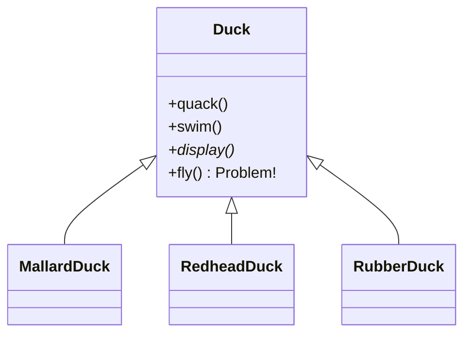
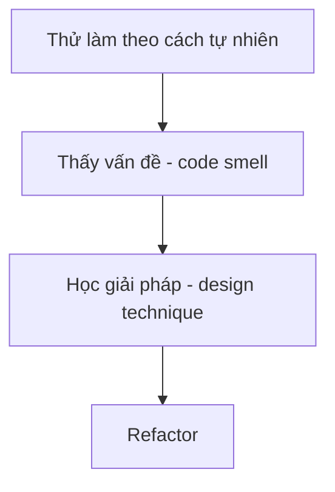

# Module 2: Variation Handling

> *"What if you need FLYING and QUACKING behaviors? Inheritance won't cut it!"*  
> — Head First Design Patterns (SimUDuck story)

Học cách xử lý nhiều biến thể của cùng một loại object.

---

## Câu chuyện SimUDuck 🦆

Từ **Head First Design Patterns**:



**Vấn đề:**
1. Sếp muốn thêm `fly()` → Thêm vào Duck base class
2. **RubberDuck cũng bay được!** 😱
3. Fix bằng override? → Thêm nhiều loại vịt = override ở mọi nơi!

### Bài học

> **Inheritance không phải lúc nào cũng là giải pháp tốt nhất.**

---

## Bối cảnh: Survival Shooter

Bạn đã có Zombie và Weapon từ Module 1.  
Giờ cần thêm nhiều loại:
- **Zombie**: BasicZombie (cơ bản), FastZombie (nhanh), TankZombie (to khỏe)
- **Weapon**: Pistol (đơn phát), Shotgun (nhiều đạn), Laser (xuyên trúng)

---

## Các Task

| Task | Vấn đề | Giải pháp học được |
|------|--------|-------------------|
| [Task: Zombie Types](./Task_ZombieTypes.md) | if/else lộn xộn | Inheritance (khi hợp lý) |
| [Task: Weapon Types](./Task_WeaponTypes.md) | Duplicate code, inflexible | **Interface + Composition** |

---

## Flow học



---

## Design Principle Preview

Module này giới thiệu 2 nguyên tắc quan trọng:

| Nguyên tắc | Ý nghĩa |
|-----------|---------|
| **"Favor Composition over Inheritance"** | HAS-A thường flexible hơn IS-A |
| **"Program to Interfaces"** | Sử dụng abstraction, không phải concrete class |

> [!TIP]
> Bạn đã thấy HAS-A ở Module 1 (Survivor HAS Weapon). Module này đi sâu hơn!

---

## Milestone

Sau khi hoàn thành, commit:
```
feat(oop): variation handling with composition
```

Tiếp theo: [Module 3: Dependency](../Module3_Dependency/README.md)
