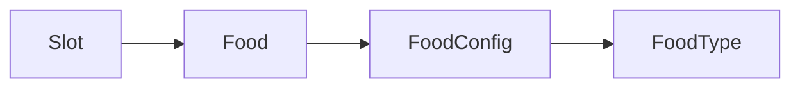
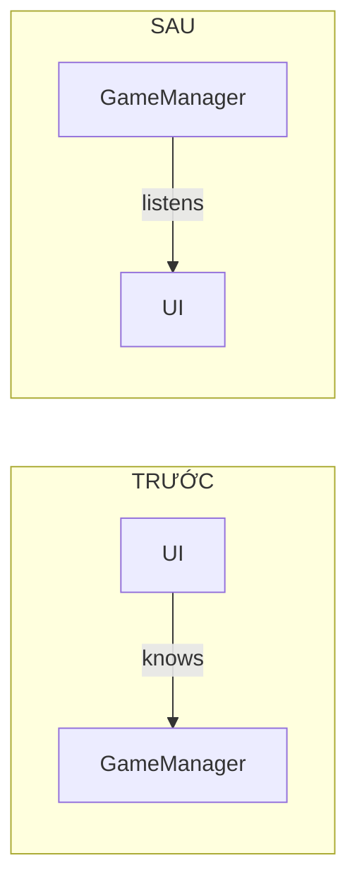

# Task: Coupling

Hiểu và giảm coupling trong code.

---

## Mục tiêu

- Nhận diện **tight coupling** trong code
- Học **Dependency Injection đơn giản** — kỹ thuật inject dependencies mà không cần framework
- Học **Interface Abstraction** — phụ thuộc abstraction thay vì implementation
- **Preview**: Dependency Inversion Principle (Phase 2)

---

## Phần 1: Nhận diện vấn đề

### Code hiện tại trong Survival Shooter

```csharp
public class Zombie : MonoBehaviour
{
    private Transform target;
    
    private void Start()
    {
        target = FindObjectOfType<Survivor>().transform;
    }
}

public class GameManager : MonoBehaviour
{
    private void Update()
    {
        var survivor = FindObjectOfType<Survivor>();
        if (survivor.Health <= 0)
        {
            EndGame();
        }
    }
}

public class UI : MonoBehaviour
{
    private GameManager manager;
    
    private void OnPlayClicked()
    {
        manager.StartGame();
    }
}
```

### Code Smells

| Code | Vấn đề | Smell |
|------|--------|-------|
| `FindObjectOfType<Survivor>()` | Phụ thuộc vào scene | 🔴 Tight coupling |
| `survivor.Health` | GameManager biết quá nhiều về Survivor | 🔴 Knowledge coupling |
| `manager.StartGame()` | UI phụ thuộc vào GameManager cụ thể | 🔴 Direct dependency |

---

## Phần 2: Dependency Injection (Đơn giản)

> [!IMPORTANT]
> **Dependency Injection (DI) đơn giản** không cần Zenject hay framework phức tạp!  
> Chỉ cần: **Thay vì tự tìm dependencies, được đưa vào từ bên ngoài**.

> *"Don't call us, we'll call you."* — Hollywood Principle

### Thay vì tự tìm, được đưa vào

**❌ Trước:**
```csharp
public class Zombie : MonoBehaviour
{
    private void Start()
    {
        target = FindObjectOfType<Survivor>().transform;
    }
}
```

**✅ Sau — DI qua Method:**
```csharp
public class Zombie : MonoBehaviour
{
    private Transform target;
    
    // Dependency được "inject" vào thông qua method
    public void Initialize(Transform target)
    {
        this.target = target;
    }
}
```

### Ai gọi Initialize?

Spawner hoặc Factory — người tạo ra Zombie:

```csharp
public class ZombieSpawner : MonoBehaviour
{
    [SerializeField] private Transform survivorTransform;
    [SerializeField] private Zombie zombiePrefab;
    
    public void SpawnZombie()
    {
        Zombie zombie = Instantiate(zombiePrefab);
        zombie.Initialize(survivorTransform);  // Inject dependency!
    }
}
```

### 3 Cách DI Đơn giản (không cần framework)

| Cách | Syntax | Khi nào dùng |
|------|--------|--------------|
| **Method Injection** | `Initialize(dependency)` | Dependency có thể thay đổi |
| **Constructor/Awake** | Set trong constructor | Immutable dependency |
| **Inspector** | `[SerializeField]` | Design-time configuration |

```csharp
// Method Injection
zombie.Initialize(target);

// Inspector Injection
[SerializeField] private Transform target;

// Factory Injection (trong method)
Zombie Create(Transform target) => new Zombie(target);
```

### Lợi ích

| Before | After |
|--------|-------|
| Zombie tự tìm Survivor | Spawner đưa target vào |
| Khó test | Dễ test (inject mock target) |
| Zombie phụ thuộc Survivor | Zombie chỉ cần Transform |

---

## Phần 3: Interface Abstraction

### Ví dụ: IDamageable

Trong survival shooter, nhiều thứ có thể nhận damage:
- Survivor
- Zombies (friendly fire?)
- Destructible objects (barrels, crates)

**❌ Trước — Phụ thuộc concrete class:**
```csharp
public class Bullet : MonoBehaviour
{
    private void OnTriggerEnter(Collider other)
    {
        var zombie = other.GetComponent<Zombie>();
        if (zombie != null)
        {
            zombie.TakeDamage(damage);
        }
    }
}
```

**Vấn đề:** Bullet chỉ damage được Zombie, không damage được objects khác!

**✅ Sau — Phụ thuộc interface:**
```csharp
public interface IDamageable
{
    void TakeDamage(int amount);
}

public class Zombie : MonoBehaviour, IDamageable
{
    public void TakeDamage(int amount)
    {
        health -= amount;
    }
}

public class DestructibleBarrel : MonoBehaviour, IDamageable
{
    public void TakeDamage(int amount)
    {
        Explode();
    }
}

public class Bullet : MonoBehaviour
{
    private void OnTriggerEnter(Collider other)
    {
        if (other.TryGetComponent<IDamageable>(out var target))
        {
            target.TakeDamage(damage);  // Works for Zombie, Barrel, anything!
        }
    }
}
```

### Lợi ích

- ✅ Bullet không biết cụ thể đang damage gì
- ✅ Có thể thêm loại damageable mới mà không sửa Bullet
- ✅ Dễ test với mock IDamageable

---

## 🔥 Ví dụ thực tế: Foodie Sizzle

### Cấu trúc Match-3



### ❌ CẤM: Slot truy cập trực tiếp Type của Food

```csharp
public class Slot : MonoBehaviour
{
    public Food food;
    
    public bool CanMatch(Slot other)
    {
        // ❌ Slot "biết quá nhiều" về internal của Food
        return food.config.type == other.food.config.type;
    }
}
```

### ✅ NÊN: Thông qua Food's public interface

```csharp
public class Food : MonoBehaviour
{
    [SerializeField] private FoodConfig config;
    
    // Food expose method, encapsulate internal logic
    public bool IsSameType(Food other)
    {
        return config.type == other.config.type;
    }
}

public class Slot : MonoBehaviour
{
    public Food food;
    
    public bool CanMatch(Slot other)
    {
        // ✅ Slot chỉ gọi Food's public method
        return food.IsSameType(other.food);
    }
}
```

> [!IMPORTANT]
> **Law of Demeter (LoD)**: Một object chỉ nên nói chuyện với "friends" trực tiếp của nó:
> - Slot → Food ✅
> - Slot → Food.Config ❌
> - Slot → Food.Config.Type ❌❌

---

## Phần 4: Events (Preview cho Task tiếp theo)

### UI → GameManager

**❌ Trước:**
```csharp
public class UI : MonoBehaviour
{
    private GameManager manager;
    
    private void OnPlayClicked()
    {
        manager.StartGame();
    }
}
```

**✅ Sau:**
```csharp
public class UI : MonoBehaviour
{
    public event Action OnPlayRequested;
    
    private void OnPlayClicked()
    {
        OnPlayRequested?.Invoke();
    }
}

public class GameManager : MonoBehaviour
{
    [SerializeField] private UI ui;
    
    private void Start()
    {
        ui.OnPlayRequested += StartGame;
    }
    
    private void StartGame()
    {
        // Start game logic
    }
}
```

### Đảo ngược dependency!



UI **không biết** ai sẽ handle event → **loose coupling**!

---

## Phần 5: Thực hành

### Bước 1: Refactor Zombie

Sửa Zombie để nhận target qua `Initialize()`.

### Bước 2: Tạo IDamageable

Tách damage logic ra interface, áp dụng cho Zombie và Survivor.

### Bước 3: Chuẩn bị cho Events

Xem [Task: Events](./Task_Events.md) để học chi tiết về C# Events.

---

## Kiểm tra

- ✅ Zombie không dùng `FindObjectOfType`
- ✅ Bullet dùng `IDamageable`, không dùng Zombie trực tiếp
- ✅ Hiểu concept của Events (chi tiết ở task tiếp)

---

## Dependency Inversion Principle Preview

> *"Depend on abstractions, not on concretions."*

| Before | After |
|--------|-------|
| Bullet → Zombie | Bullet → IDamageable ← Zombie |
| High-level depends on low-level | Both depend on abstraction |

Đây là **DIP (Dependency Inversion Principle)** — sẽ học chi tiết ở Phase 2!

---

## Kiến thức rút ra

| Khái niệm | Áp dụng |
|-----------|---------|
| **DI đơn giản** | Được đưa vào thay vì tự tìm (không cần framework!) |
| **Interface abstraction** | Phụ thuộc abstraction, không phải implementation |
| **Law of Demeter** | Chỉ nói chuyện với friends trực tiếp |
| **Events preview** | Loose coupling qua event system |
| **DIP preview** | Depend on interfaces |

---

## Tóm tắt coupling

| Tight Coupling | Loose Coupling |
|----------------|----------------|
| `FindObjectOfType` | Method/Inspector injection |
| Direct class reference | Interface |
| Direct method call | Events |
| Hard to test | Easy to test |
| Change ripples | Change isolated |

---

## Commit

```
feat(oop): implement loose coupling patterns
```

Tiếp theo: [Task: Events](./Task_Events.md)
