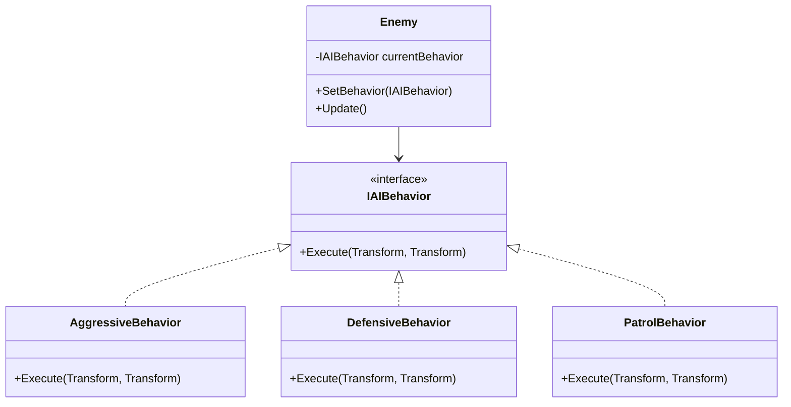

# Pattern 1: Strategy

> *"Define a family of algorithms, encapsulate each one, and make them interchangeable. Strategy lets the algorithm vary independently from clients that use it."*  
> — Head First Design Patterns

Thay đổi behavior của object runtime mà không sửa code.

---

## Recall Phase 2 🔙

Bạn đã thấy Strategy ở **Principle 1: Encapsulate What Changes**:
- `IWeapon` interface trong `Survivor`
- `Pistol`, `Shotgun`, `Laser` implementations
- Survivor swap weapon runtime

Đó chính là **Strategy Pattern**! Giờ ta đi sâu hơn.

---

## Feature: AI Behavior

Enemy cần có nhiều kiểu AI:
- **Aggressive**: Lao thẳng vào player
- **Defensive**: Giữ khoảng cách
- **Patrol**: Đi tuần tra

Và có thể đổi behavior runtime (ví dụ: low health → defensive).

---

## Phần 1: Cách sai — If/Else

```csharp
public class Enemy : MonoBehaviour
{
    public enum AIType { Aggressive, Defensive, Patrol }
    
    [SerializeField] private AIType aiType;
    
    private void Update()
    {
        switch (aiType)
        {
            case AIType.Aggressive:
                ChasePlayer();
                break;
            case AIType.Defensive:
                KeepDistance();
                break;
            case AIType.Patrol:
                PatrolArea();
                break;
        }
    }
    
    private void ChasePlayer() { /* ... */ }
    private void KeepDistance() { /* ... */ }
    private void PatrolArea() { /* ... */ }
}
```

### Vấn đề

| Issue | Violates |
|-------|----------|
| Thêm AI mới → sửa Enemy class | **Open/Closed** (Phase 2) |
| Enemy class ngày càng phình | Single Responsibility |
| Khó reuse AI behavior cho NPC khác | Composition |
| Đã học ở Phase 2! | "Encapsulate What Changes" |

---

## Phần 2: Strategy Pattern

### Cấu trúc



---

## Phần 3: Implementation

### Interface

```csharp
public interface IAIBehavior
{
    void Execute(Transform self, Transform target);
}
```

### Concrete Strategies

```csharp
public class AggressiveBehavior : IAIBehavior
{
    private float chaseSpeed = 5f;
    
    public void Execute(Transform self, Transform target)
    {
        if (target == null) return;
        
        Vector3 direction = (target.position - self.position).normalized;
        self.position += direction * chaseSpeed * Time.deltaTime;
    }
}

public class DefensiveBehavior : IAIBehavior
{
    private float safeDistance = 8f;
    private float retreatSpeed = 4f;
    
    public void Execute(Transform self, Transform target)
    {
        if (target == null) return;
        
        float distance = Vector3.Distance(self.position, target.position);
        
        if (distance < safeDistance)
        {
            // Retreat
            Vector3 direction = (self.position - target.position).normalized;
            self.position += direction * retreatSpeed * Time.deltaTime;
        }
    }
}

public class PatrolBehavior : IAIBehavior
{
    private Vector3[] waypoints;
    private int currentWaypoint;
    private float patrolSpeed = 3f;
    
    public PatrolBehavior(Vector3[] waypoints)
    {
        this.waypoints = waypoints;
    }
    
    public void Execute(Transform self, Transform target)
    {
        if (waypoints == null || waypoints.Length == 0) return;
        
        Vector3 destination = waypoints[currentWaypoint];
        self.position = Vector3.MoveTowards(
            self.position, 
            destination, 
            patrolSpeed * Time.deltaTime
        );
        
        if (Vector3.Distance(self.position, destination) < 0.1f)
        {
            currentWaypoint = (currentWaypoint + 1) % waypoints.Length;
        }
    }
}
```

### Context (Enemy)

```csharp
public class Enemy : MonoBehaviour
{
    private IAIBehavior currentBehavior;
    private Transform target;
    
    public void SetBehavior(IAIBehavior behavior)
    {
        currentBehavior = behavior;
    }
    
    private void Update()
    {
        currentBehavior?.Execute(transform, target);
    }
    
    // Đổi behavior khi health thấp
    public void OnHealthChanged(float healthPercent)
    {
        if (healthPercent < 0.3f)
        {
            SetBehavior(new DefensiveBehavior());
        }
    }
}
```

---

## Phần 4: Advanced — ScriptableObject Strategy 🚀
> [!TIP]
> Video có sử dụng: [Clean Code using the Strategy Pattern](../RESOURCES.md#phase-3-design-patterns)

Cách dùng `new Class()` ở trên là C# thuẩn. Trong Unity, ta có thể dùng **ScriptableObject** để kéo thả behavior ngay trên Inspector!

### 1. Abstract ScriptableObject

```csharp
public abstract class AIBehaviorSO : ScriptableObject
{
    public abstract void Execute(Transform self, Transform target);
}
```

### 2. Concrete Asset

```csharp
[CreateAssetMenu(fileName = "AggressiveAI", menuName = "AI/Aggressive")]
public class AggressiveAI_SO : AIBehaviorSO
{
    public float chaseSpeed = 5f;

    public override void Execute(Transform self, Transform target)
    {
        // Logic di chuyển
    }
}
```

### 3. Usage trên Inspector

```csharp
public class Enemy : MonoBehaviour
{
    [SerializeField] private AIBehaviorSO currentBehavior; // Kéo thả asset vào đây!

    private void Update()
    {
        currentBehavior?.Execute(transform, target);
    }
}
```

**Lợi ích:** Game Designer có thể tạo ra 10 loại AI khác nhau chỉ bằng cách tạo Asset, không cần code!

---

---

## Phần 5: Ưu & Nhược điểm (Góc nhìn thực tế)
 
| Ưu điểm (Pros) | Nhược điểm (Cons) |
|----------------|-------------------|
| **Clean Code**: Class chính (`Enemy`) cực kỳ gọn, chỉ lo delegating. | **Class explosion**: Mỗi chiến thuật là 1 file class riêng. |
| **Separation of Concerns**: Logic AI không dính líu đến logic `Enemy`. | **Communication**: Strategy class cần access data của `Enemy` (khó nếu data private). |
| **Hot Swapping**: Đổi hành vi ngay lập tức (Rất mạnh với ScriptableObject). | **Complexity**: Client phải biết cách chọn strategy phù hợp. |

---

## Phần 6: Khi nào DÙNG? (Khi nào KHÔNG?)

### ✅ Khi nào DÙNG:
- **Game AI**: Aggressive, Defensive, Patton, Flee.
- **Vũ khí/Skill**: Gun, Sword, Magic (mỗi cái là 1 strategy).
- **Movement**: Walk, Fly, Swim.
- **Sorting/Filtering**: Sort by Price, Name, Date (trong Inventory).

### ❌ Khi nào KHÔNG dùng (Alternatives):
- **Behavior quá đơn giản**: Chỉ có 1-2 dòng code khác nhau (`if (isFlying)` vẫn OK).
- **Inheritance là đủ**: Nếu behavior gắn chặt với type (`FlyingEnemy` luôn bay, không bao giờ đi bộ).
- **Chỉ thay đổi data**: Nếu chỉ khác nhau về `speed`, `damage` -> Dùng config variable, không cần Strategy class.

---

---

## Phần 7: Thực hành

### Bước 1: Interface `IAIBehavior`

Tạo interface chung cho mọi hành vi AI.

### Bước 2: ScriptableObject Strategy

Tạo `AIBehaviorSO` (abstract class) và 2 concrete assets (`AggressiveSO`, `DefensiveSO`).

### Bước 3: Refactor Enemy

Thay đổi `Enemy` để dùng `AIBehaviorSO` thay vì hardcode logic.
Inject behavior qua Inspector.

### Bước 4: Test Editor

Tạo 2 file asset khác nhau, kéo thả vào Enemy lúc đang chạy game -> Xem AI thay đổi hành vi ngay lập tức!

---

## Kiểm tra

- ✅ Enemy class không có switch/case về AI
- ✅ Có thể swap AI behavior runtime
- ✅ Behavior reusable cho nhiều enemy types

---

## Kiến thức rút ra

| Khái niệm | Áp dụng |
|-----------|---------|
| **Strategy Pattern** | Encapsulate behaviors |
| **Interface** | Define contract cho behaviors |
| **Composition** | Enemy HAS behavior |
| **Open/Closed** | Thêm behavior không sửa Enemy |

---

## Áp dụng trong game

- AI behaviors
- Movement types
- Attack patterns
- Skill effects
- Pricing strategies

---

## Commit

```
feat(patterns): implement strategy pattern for AI
```

Tiếp theo: [Pattern 2: Observer](./Pattern2_Observer.md)
