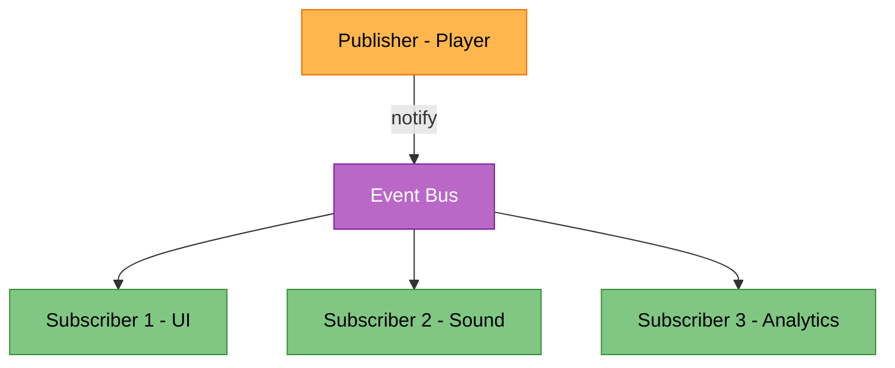

# Pattern 2: Observer

> *"The Observer Pattern defines a one-to-many dependency between objects so that when one object changes state, all of its dependents are notified and updated automatically."*  
> — Head First Design Patterns

Notify nhiều objects khi có sự kiện xảy ra, mà không cần biết chúng là ai.

---

## Recall Phase 2 🔙

Bạn đã thấy Observer ở **Principle 4: Low Coupling / High Cohesion**:
- `GameEvents` class với C# Events
- Subscribers đăng ký và nhận notifications
- Player không biết ai đang listen

Đó chính là **Observer Pattern**! Giờ ta đi sâu hơn.

---

## Feature: Event System

Khi player nhặt coin:
- UI cập nhật score
- Sound effect
- Achievement check
- Analytics log
- Particle effect

Làm sao để Player không cần biết tất cả những thứ này?

---

## Phần 1: Cách sai — Direct References

```csharp
public class Player : MonoBehaviour
{
    [SerializeField] private ScoreUI scoreUI;
    [SerializeField] private AudioManager audioManager;
    [SerializeField] private AchievementSystem achievements;
    [SerializeField] private Analytics analytics;
    [SerializeField] private ParticleSystem coinVFX;
    
    public void CollectCoin()
    {
        score++;
        
        scoreUI.UpdateScore(score);
        audioManager.Play("coin_pickup");
        achievements.Check("collect_coins", score);
        analytics.Log("coin_collected");
        coinVFX.Play();
    }
}
```

### Vấn đề

| Issue | Violates |
|-------|----------|
| Player biết quá nhiều thứ | **Low Coupling** (Phase 2) |
| Thêm listener mới → sửa Player | Open/Closed |
| Không thể test Player riêng | Testability |
| 5 dependencies! | Single Responsibility |

---

## Phần 2: Observer Pattern

### Cấu trúc



---

---

## Phần 3: Implementation — Basic Approaches

### Cách 1: C# Events (Code-driven)

Gọn nhẹ, hiệu năng cao nhất.

```csharp
public class Player : MonoBehaviour
{
    // `Action` là delegate có sẵn của C# (System namespace)
    public event Action<int> OnCoinCollected; 

    public void CollectCoin()
    {
        score++;
        OnCoinCollected?.Invoke(score); // Notify all listeners
    }
}
```

**Subscriber:**
```csharp
private void OnEnable() => player.OnCoinCollected += UpdateUI;
private void OnDisable() => player.OnCoinCollected -= UpdateUI;
```

### Cách 2: UnityEvents (Inspector-driven)

Dễ dùng cho Designer, kéo thả được trong Inspector (giống Button OnClick).

```csharp
using UnityEngine.Events;

public class Player : MonoBehaviour
{
    public UnityEvent<int> OnCoinCollected; // Hiện trên Inspector!

    public void CollectCoin()
    {
        score++;
        OnCoinCollected?.Invoke(score);
    }
}
```

**Ưu điểm:** Designer có thể kéo AudioSource, ParticleSystem vào thẳng Inspector mà không cần code.
**Nhược điểm:** Chậm hơn C# Event, khó debug ai đang gọi ai nếu quá nhiều connection.

---

## Phần 4: Advanced — ScriptableObject Event Channel 🚀

Đây là kiến trúc **Game Architecture** hiện đại (như Ryan Hipple talk tại Unite).

### 1. Tạo Event Channel Asset

```csharp
[CreateAssetMenu(menuName = "Events/Void Event Channel")]
public class VoidEventChannelSO : ScriptableObject
{
    public event Action OnEventRaised;

    public void RaiseEvent()
    {
        OnEventRaised?.Invoke();
    }
}
```

### 2. Publisher (Player)

Không cần biết ai lắng nghe, chỉ cần reference tới file asset.

```csharp
public class Player : MonoBehaviour
{
    [SerializeField] private VoidEventChannelSO onPlayerDied;

    public void Die()
    {
        onPlayerDied.RaiseEvent(); // Bắn sự kiện vào asset
    }
}
```

### 3. Listener (UI)

Cũng chỉ cần reference tới file asset đó.

```csharp
public class GameOverUI : MonoBehaviour
{
    [SerializeField] private VoidEventChannelSO onPlayerDied;

    private void OnEnable() => onPlayerDied.OnEventRaised += ShowGameOver;
    private void OnDisable() => onPlayerDied.OnEventRaised -= ShowGameOver;

    private void ShowGameOver() { /* Show UI */ }
}
```

**Lợi ích:** Player và UI hoàn toàn tách biệt. Có thể test UI mà không cần Player, chỉ cần file asset!

---

## Phần 5: Implementation — Event Bus (Decoupled)

> [!TIP] Video đề cập
> [Learn to Build an Advanced Event Bus | Unity Architecture](../RESOURCES.md#phase-3-design-patterns)

### Centralized Event System

```csharp
public static class EventBus
{
    private static Dictionary<Type, Delegate> events = new Dictionary<Type, Delegate>();
    
    public static void Subscribe<T>(Action<T> handler)
    {
        Type eventType = typeof(T);
        if (events.ContainsKey(eventType))
        {
            events[eventType] = Delegate.Combine(events[eventType], handler);
        }
        else
        {
            events[eventType] = handler;
        }
    }
    
    public static void Unsubscribe<T>(Action<T> handler)
    {
        Type eventType = typeof(T);
        if (events.ContainsKey(eventType))
        {
            events[eventType] = Delegate.Remove(events[eventType], handler);
        }
    }
    
    public static void Publish<T>(T eventData)
    {
        Type eventType = typeof(T);
        if (events.ContainsKey(eventType))
        {
            ((Action<T>)events[eventType])?.Invoke(eventData);
        }
    }
}
```

### Event Data

```csharp
public struct CoinCollectedEvent
{
    public int TotalCoins;
    public Vector3 Position;
}
```

---

## Phần 6: Ưu & Nhược điểm (Góc nhìn thực tế)

| Ưu điểm (Pros) | Nhược điểm (Cons) |
|----------------|-------------------|
| **Decoupling tuyệt đối**: Publisher không biết Subscriber là ai (và ngược lại nếu dùng Event Bus). | **Memory Leaks**: Quên `Unsubscribe` = Crash game/Lỗi logic khó tìm. |
| **Open/Closed**: Thêm tính năng mới (Sound, Achievement) không cần sửa code cũ. | **Spaghetti Flow**: Khó debug vì luồng chạy nhảy lung tung ("Ai gọi hàm này??"). |
| **Scalability**: Dễ dàng scale game từ nhỏ -> lớn. | **Overhead**: Nếu gọi 1000 events/frame sẽ có chi phí performance (dù nhỏ). |

---

## Phần 7: Khi nào DÙNG? (Khi nào KHÔNG?)

### ✅ Khi nào DÙNG:
- **UI System**: Cập nhật HP, Score, Ammo.
- **Achievements/Quests**: Mở khóa khi đạt điều kiện.
- **Audio System**: Phát âm thanh khi có sự kiện gameplay.
- **Game State**: Start, Pause, Game Over.

### ❌ Khi nào KHÔNG dùng:
- **Core Loop chặt chẽ**: A -> B -> C phải chạy đúng thứ tự từng frame (Character Movement update).
- **Quá đơn giản**: Gọi `player.Heal()` dễ hiểu hơn là bắn event `OnHealRequired`.
- **Nếu cần Return Value**: Event thường là `void` (fire and forget). Nếu cần trả về kết quả, hãy dùng Method call hoặc Service.

---

---

## Phần 8: Memory Leak Warning ⚠️

### Vấn đề

```csharp
private void OnEnable()
{
    player.OnCoinCollected += UpdateScore;
}

// QUÊN OnDisable → Memory leak!
// Khi ScoreUI bị destroy, Player vẫn giữ reference tới nó -> ScoreUI không bao giờ được GC -> Leak!
```

### Quy tắc

**LUÔN unsubscribe trong OnDisable hoặc OnDestroy!**

```csharp
private void OnDisable()
{
    player.OnCoinCollected -= UpdateScore;
}
```

---

## Phần 9: Thực hành

### Bước 1: Basic Event
Tạo `OnHealthChanged` event trong `Survivor`.
UI Subscribe để update Health Bar.

### Bước 2: ScriptableObject Event
Tạo `VoidEventChannelSO` cho sự kiện `OnPlayerDied`.
Player raise event, Game Manager lắng nghe để Restart game.

### Bước 3: Debug
Thử xóa dòng `Unsubscribe` trong `OnDisable` của UI.
Chơi đi chơi lại scene xem memory có tăng không? (Hoặc check Log Error khi object bị Destroy mà event vẫn gọi).

---

## Kiểm tra

- ✅ Player không reference trực tiếp các UI/Systems
- ✅ Subscribers tự đăng ký
- ✅ Có unsubscribe đúng cách
- ✅ Thêm subscriber mới không sửa Player

---

## Kiến thức rút ra

| Khái niệm | Áp dụng |
|-----------|---------|
| **Observer Pattern** | Pub/Sub model |
| **Loose Coupling** | Publisher không biết subscribers |
| **Memory Management** | Always unsubscribe |
| **Scalability** | Dễ thêm listeners |

---

## Commit

```
feat(patterns): implement observer pattern for events
```

Tiếp theo: [Pattern 3: Object Pool](./Pattern3_ObjectPool.md)
