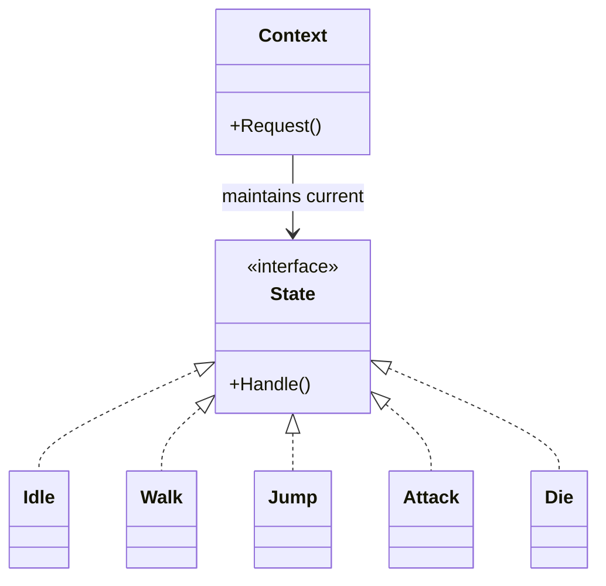

# Pattern 5: State

> *"Allow an object to alter its behavior when its internal state changes. The object will appear to change its class."*  
> — Game Programming Patterns

Quản lý trạng thái phức tạp một cách clean.

---

## 🎮 Game-Specific Pattern

State Pattern rất phổ biến trong games:

Từ Game Programming Patterns:
> *"Finite state machines are an incredibly common modeling tool, particularly in games. Characters, enemies, UI screens, and even game logic can often be described as a state machine."*

---

## Feature: Player States

Player có nhiều trạng thái:
- Idle
- Walking
- Running
- Jumping
- Attacking
- Dying

Mỗi trạng thái có behavior khác nhau.

---

## Phần 1: Cách sai — Boolean Flags

```csharp
public class Player : MonoBehaviour
{
    private bool isWalking;
    private bool isRunning;
    private bool isJumping;
    private bool isAttacking;
    private bool isDying;
    
    private void Update()
    {
        if (isDying)
        {
            // Can't do anything
            return;
        }
        
        if (isAttacking)
        {
            // Attack logic
            if (!isJumping)
            {
                // Ground attack
            }
            else
            {
                // Air attack
            }
        }
        else if (isJumping)
        {
            // Jump logic
            if (Input.GetKeyDown(KeyCode.Space))
            {
                // Double jump?
            }
        }
        else if (isRunning)
        {
            // Run logic
        }
        else if (isWalking)
        {
            // Walk logic
        }
        else
        {
            // Idle logic
        }
    }
}
```

### Vấn đề

| Issue | Problem |
|-------|---------|
| Spaghetti logic | Hard to read |
| Dễ quên set flag | Bugs |
| State conflicts (walking + running?) | Undefined behavior |
| Thêm state mới → sửa nhiều chỗ | Maintenance nightmare |
| Debug nightmare | Which flags are true? |

---

## Phần 2: State Pattern

### Cấu trúc



---

## Phần 3: Implementation

### State Interface

```csharp
public interface IPlayerState
{
    void Enter(PlayerController player);
    void Update(PlayerController player);
    void Exit(PlayerController player);
}
```

### Concrete States

```csharp
public class IdleState : IPlayerState
{
    public void Enter(PlayerController player)
    {
        player.Animator.Play("Idle");
    }
    
    public void Update(PlayerController player)
    {
        // Check for transitions
        if (Input.GetAxis("Horizontal") != 0)
        {
            player.ChangeState(new WalkState());
        }
        else if (Input.GetKeyDown(KeyCode.Space))
        {
            player.ChangeState(new JumpState());
        }
        else if (Input.GetMouseButtonDown(0))
        {
            player.ChangeState(new AttackState());
        }
    }
    
    public void Exit(PlayerController player)
    {
        // Cleanup if needed
    }
}

public class WalkState : IPlayerState
{
    public void Enter(PlayerController player)
    {
        player.Animator.Play("Walk");
    }
    
    public void Update(PlayerController player)
    {
        float horizontal = Input.GetAxis("Horizontal");
        
        if (horizontal == 0)
        {
            player.ChangeState(new IdleState());
            return;
        }
        
        // Move
        player.Move(horizontal * player.WalkSpeed);
        
        // Check for run
        if (Input.GetKey(KeyCode.LeftShift))
        {
            player.ChangeState(new RunState());
        }
        else if (Input.GetKeyDown(KeyCode.Space))
        {
            player.ChangeState(new JumpState());
        }
    }
    
    public void Exit(PlayerController player) { }
}

public class JumpState : IPlayerState
{
    private bool hasJumped;
    
    public void Enter(PlayerController player)
    {
        player.Animator.Play("Jump");
        player.Jump();
        hasJumped = true;
    }
    
    public void Update(PlayerController player)
    {
        // Air control
        float horizontal = Input.GetAxis("Horizontal");
        player.Move(horizontal * player.AirSpeed);
        
        // Check for landing
        if (player.IsGrounded && hasJumped)
        {
            player.ChangeState(new IdleState());
        }
    }
    
    public void Exit(PlayerController player) { }
}
```

### Player Controller (Context)

```csharp
public class PlayerController : MonoBehaviour
{
    public Animator Animator { get; private set; }
    public float WalkSpeed = 5f;
    public float AirSpeed = 3f;
    public bool IsGrounded { get; private set; }
    
    private IPlayerState currentState;
    
    private void Start()
    {
        Animator = GetComponent<Animator>();
        ChangeState(new IdleState());
    }
    
    private void Update()
    {
        currentState?.Update(this);
    }
    
    public void ChangeState(IPlayerState newState)
    {
        currentState?.Exit(this);
        currentState = newState;
        currentState?.Enter(this);
    }
    
    public void Move(float speed)
    {
        transform.Translate(Vector3.right * speed * Time.deltaTime);
    }
    
    public void Jump()
    {
        GetComponent<Rigidbody>().AddForce(Vector3.up * 10f, ForceMode.Impulse);
    }
}
```

---

## Phần 4: So sánh Strategy vs State

| Strategy | State |
|----------|-------|
| Thay đổi **algorithm** | Thay đổi **trạng thái** |
| Injected từ **bên ngoài** | Tự **transition bên trong** |
| Không biết strategies khác | **Biết và chuyển** sang state khác |
| AI behaviors, movement types | Player states, UI screens |

> [!TIP]
> **Strategy** = "Làm cùng một việc theo nhiều cách"  
> **State** = "Làm những việc khác nhau dựa trên trạng thái"

---

## Phần 5: Ưu & Nhược điểm

| Ưu điểm (Pros) | Nhược điểm (Cons) |
|----------------|-------------------|
| **Clean Code**: Thay thế đống `if/else` khổng lồ bằng các class nhỏ gọn. | **More Classes**: Mỗi state là 1 file. |
| **SRP**: Mỗi state chỉ lo behavior của chính nó. | **Transitions**: Logic chuyển state có thể bị phân mảnh (nằm rải rác trong các state). |
| **Extensible**: Thêm state mới dễ dàng. | **Overhead**: Nếu state quá đơn giản, tạo class là overkill. |

---

## Phần 6: Khi nào dùng? (Khi nào KHÔNG?)

### ✅ Khi nào DÙNG:
- Khi object có nhiều trạng thái, và behavior thay đổi TÙY THUỘC vào trạng thái đó (Player, Enemy Boss, UI Screens).
- Khi code có quá nhiều `if (isDoingA) ... else if (isDoingB)`.
- Khi các state có transition phức tạp (Idle -> Walk -> Run -> Jump -> Attack -> Idle).

### ❌ Khi nào KHÔNG dùng:
- Khi object chỉ có 2-3 state đơn giản (dùng `enum` và `switch/case` là đủ).
- Khi các state không có behavior khác nhau nhiều.

---

## Phần 7: Thực hành

### Bước 1: Tạo `IPlayerState` interface

### Bước 2: Tạo các states
- `IdleState`
- `WalkState`
- `JumpState`
- `AttackState`

### Bước 3: Tạo `PlayerController`
- Quản lý current state
- `ChangeState()` method

### Bước 4: Test transitions
- Idle → Walk → Jump → Idle

---

## Kiểm tra

- ✅ Không có boolean flags cho states
- ✅ Mỗi state là 1 class riêng
- ✅ Transitions rõ ràng
- ✅ Dễ thêm state mới

---

## Kiến thức rút ra

| Khái niệm | Áp dụng |
|-----------|---------|
| **State Pattern** | Encapsulate state-specific behavior |
| **State Machine** | Manage transitions |
| **Enter/Update/Exit** | Lifecycle hooks |
| **vs Strategy** | Internal transitions vs external swap |

---

## Commit

```
feat(patterns): implement state pattern for player
```

Tiếp theo: [Pattern 6: Command](./Pattern6_Command.md)
