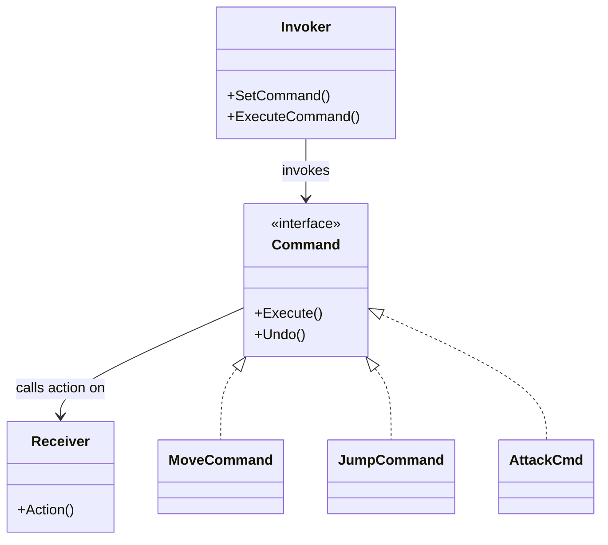

# Pattern 6: Command

> *"A command is a reified method call—a method call wrapped in an object."*  
> — Game Programming Patterns

Đóng gói action thành object để queue, undo, hoặc replay.

---

## 🎮 Game-Specific Pattern

Command Pattern cực kỳ hữu ích trong games:

Từ Game Programming Patterns:
> *"Commands are an object-oriented replacement for callbacks. This pattern is especially useful in games for handling player input, supporting undo and redo, creating replays, and implementing AI."*

---

## Recall Phase 2 🔙

- **Principle 1 (Encapsulate What Changes)**: Action thay đổi? Đóng gói nó thành `Command` object!
- **Principle 2 (Composition)**: Input Handler "has a" command invoker.

---

## Feature: Input System với Undo

- Player có thể undo action vừa làm
- Input buffer cho combo system
- Replay system cho debugging

---

## Phần 1: Cách sai — Direct Execution

```csharp
public class InputHandler : MonoBehaviour
{
    private void Update()
    {
        if (Input.GetKeyDown(KeyCode.W))
        {
            player.MoveUp();  // Executed immediately, cannot undo
        }
        if (Input.GetKeyDown(KeyCode.Space))
        {
            player.Jump();
        }
        if (Input.GetMouseButtonDown(0))
        {
            player.Attack();
        }
    }
}
```

### Vấn đề

| Issue | Problem |
|-------|---------|
| Không thể undo | No history |
| Không thể queue actions | Immediate execution |
| Không thể replay | No record |
| Tightly coupled | Input → Actor |

---

## Phần 2: Command Pattern

### Cấu trúc



---

## Phần 3: Implementation

### Command Interface

```csharp
public interface ICommand
{
    void Execute();
    void Undo();
}
```

### Concrete Commands

```csharp
public class MoveCommand : ICommand
{
    private Transform transform;
    private Vector3 direction;
    private float distance;
    
    private Vector3 previousPosition;
    
    public MoveCommand(Transform transform, Vector3 direction, float distance)
    {
        this.transform = transform;
        this.direction = direction;
        this.distance = distance;
    }
    
    public void Execute()
    {
        previousPosition = transform.position;
        transform.position += direction * distance;
    }
    
    public void Undo()
    {
        transform.position = previousPosition;
    }
}

public class AttackCommand : ICommand
{
    private Player player;
    private Enemy target;
    private int damage;
    
    public AttackCommand(Player player, Enemy target, int damage)
    {
        this.player = player;
        this.target = target;
        this.damage = damage;
    }
    
    public void Execute()
    {
        target.TakeDamage(damage);
    }
    
    public void Undo()
    {
        target.Heal(damage);
    }
}
```

### Command Invoker với History

```csharp
public class CommandInvoker
{
    private Stack<ICommand> history = new Stack<ICommand>();
    private Stack<ICommand> redoStack = new Stack<ICommand>();
    
    public void Execute(ICommand command)
    {
        command.Execute();
        history.Push(command);
        redoStack.Clear();  // Clear redo when new action
    }
    
    public void Undo()
    {
        if (history.Count == 0) return;
        
        ICommand command = history.Pop();
        command.Undo();
        redoStack.Push(command);
    }
    
    public void Redo()
    {
        if (redoStack.Count == 0) return;
        
        ICommand command = redoStack.Pop();
        command.Execute();
        history.Push(command);
    }
}
```

### Input Handler sử dụng Commands

```csharp
public class InputHandler : MonoBehaviour
{
    [SerializeField] private Player player;
    
    private CommandInvoker invoker = new CommandInvoker();
    
    private void Update()
    {
        if (Input.GetKeyDown(KeyCode.W))
        {
            var command = new MoveCommand(player.transform, Vector3.forward, 1f);
            invoker.Execute(command);
        }
        
        if (Input.GetKeyDown(KeyCode.Z) && Input.GetKey(KeyCode.LeftControl))
        {
            invoker.Undo();
        }
        
        if (Input.GetKeyDown(KeyCode.Y) && Input.GetKey(KeyCode.LeftControl))
        {
            invoker.Redo();
        }
    }
}
```

---

## Phần 4: Input Buffer cho Combo

```csharp
public class ComboSystem : MonoBehaviour
{
    private Queue<ICommand> inputBuffer = new Queue<ICommand>();
    private float bufferTime = 0.5f;
    private float lastInputTime;
    
    public void BufferInput(ICommand command)
    {
        if (Time.time - lastInputTime > bufferTime)
        {
            inputBuffer.Clear();
        }
        
        inputBuffer.Enqueue(command);
        lastInputTime = Time.time;
        
        CheckCombo();
    }
    
    private void CheckCombo()
    {
        // Check if buffered inputs match a combo
        if (inputBuffer.Count >= 3)
        {
            // Execute combo
        }
    }
}
```

---

## Phần 5: Replay System

```csharp
public class ReplaySystem : MonoBehaviour
{
    private List<TimestampedCommand> recording = new List<TimestampedCommand>();
    private float startTime;
    private bool isRecording;
    
    public void StartRecording()
    {
        recording.Clear();
        startTime = Time.time;
        isRecording = true;
    }
    
    public void RecordCommand(ICommand command)
    {
        if (!isRecording) return;
        
        recording.Add(new TimestampedCommand
        {
            Command = command,
            Timestamp = Time.time - startTime
        });
    }
    
    public void StopRecording()
    {
        isRecording = false;
    }
    
    public IEnumerator PlayReplay()
    {
        float replayStart = Time.time;
        
        foreach (var record in recording)
        {
            yield return new WaitUntil(() => 
                Time.time - replayStart >= record.Timestamp
            );
            
            record.Command.Execute();
        }
    }
}

public struct TimestampedCommand
{
    public ICommand Command;
    public float Timestamp;
}
```

---

## Phần 6: Ưu & Nhược điểm

| Ưu điểm (Pros) | Nhược điểm (Cons) |
|----------------|-------------------|
| **Undo/Redo**: Tính năng mạnh mẽ nhất của Command. | **Many Classes**: Mỗi action là 1 class nhỏ. |
| **Decoupling**: Invoker (Button, Input) không biết việc gì sẽ xảy ra. | **Complexity**: Cần quản lý History stack. |
| **Queue/Delay**: Có thể thực hiện action sau 1 khoảng thời gian (Turn-based game). | **Memory**: History stack có thể tốn bộ nhớ nếu lưu quá nhiều. |

---

## Phần 7: Khi nào dùng? (Khi nào KHÔNG?)

### ✅ Khi nào DÙNG:
- Game cần tính năng **Undo/Redo** (Strategy, Puzzle games).
- Game cần **Input Rebinding** (người chơi đổi nút).
- Game cần hệ thống **Replay** (ghi lại chuỗi hành động).
- Thực hiện chuỗi hành động theo lượt (Queue).

### ❌ Khi nào KHÔNG dùng:
- Action quá đơn giản (nhảy, bắn) và không cần Undo/Replay.
- Game Real-time action nhanh (đôi khi overhead của object creation không đáng).

---

## Phần 8: Thực hành

### Bước 1: Tạo `ICommand` interface

### Bước 2: Tạo commands
- `MoveCommand`
- `AttackCommand`

### Bước 3: Tạo `CommandInvoker` với undo/redo

### Bước 4: Test undo
- Move → Move → Undo → Undo

---

## Kiểm tra

- ✅ Actions là objects, không phải method calls
- ✅ Có thể undo actions
- ✅ History được lưu
- ✅ Dễ thêm command mới

---

## Kiến thức rút ra

| Khái niệm | Áp dụng |
|-----------|---------|
| **Command Pattern** | Actions as objects |
| **Undo/Redo** | History stack |
| **Input Buffer** | Queue commands |
| **Replay** | Record and playback |

---

## Commit

```
feat(patterns): implement command pattern for input
```

---

## 🎉 Hoàn thành Phase 3!

Bạn đã hoàn thành **Phase 3: Design Patterns**.

### Tổng kết:

| Pattern | Phase 2 Principle | Áp dụng |
|---------|-------------------|---------|
| Strategy | Encapsulate What Changes | AI behaviors |
| Observer | Low Coupling | Events |
| Object Pool | — (Performance) | Bullets |
| Factory | Program to Abstraction | Spawning |
| State | Encapsulate What Changes | Player states |
| Command | — (Actions as objects) | Undo/Replay |

### Commit milestone:
```
feat(patterns): complete phase 3 design patterns
```

---

## Tiếp theo

[Phase 4: Architecture](../Phase4_Architecture/README.md)

Ở Phase 4, bạn sẽ học cách **kết hợp nhiều patterns** thành một architecture hoàn chỉnh!
