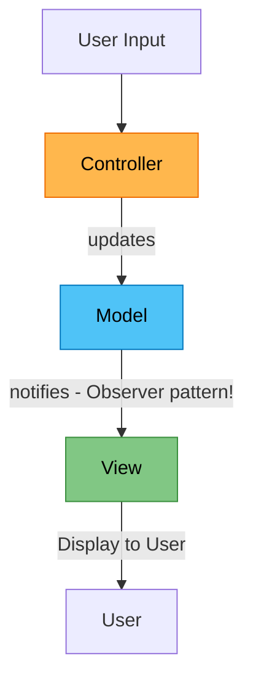

# Module 1: MVC Foundation

> *"Separation of concerns is the most important principle in software engineering."*

Hiểu Model-View-Controller trước khi học MVP.

---

## Recall Phase 3 🔙

Bạn đã học **Observer pattern** ở Phase 3:
- Publisher notify Subscribers
- Loose coupling

MVC dùng **chính xác Observer pattern** cho Model → View!

---

## 🎥 Video Reference

> [!VIDEO]
> **Improve Your Unity Code with MVC/MVP**  
> [Watch on YouTube](../../RESOURCES.md#phase-4-architecture)  
> *Xem video này để hiểu rõ sự khác biệt giữa MVC và MVP trong Unity.*

---

## MVC là gì?

**Model-View-Controller** chia ứng dụng thành 3 phần:

| Component | Vai trò | Ví dụ trong game |
|-----------|---------|------------------|
| **Model** | Data và logic | PlayerData, InventorySystem |
| **View** | Hiển thị | UI, Sprites, Animations |
| **Controller** | Xử lý input, điều phối | InputHandler, GameController |

---

## Data Flow



---

## Implementation cơ bản

### Model

```csharp
public class PlayerModel
{
    public int Health { get; private set; }
    public int MaxHealth { get; private set; }
    public int Score { get; private set; }
    
    // Observer pattern từ Phase 3!
    public event Action<int> OnHealthChanged;
    public event Action<int> OnScoreChanged;
    
    public PlayerModel(int maxHealth)
    {
        MaxHealth = maxHealth;
        Health = maxHealth;
    }
    
    public void TakeDamage(int amount)
    {
        Health = Mathf.Max(0, Health - amount);
        OnHealthChanged?.Invoke(Health);  // Notify observers
    }
    
    public void AddScore(int amount)
    {
        Score += amount;
        OnScoreChanged?.Invoke(Score);
    }
}
```

### View

```csharp
public class PlayerView : MonoBehaviour
{
    [SerializeField] private Slider healthBar;
    [SerializeField] private TextMeshProUGUI scoreText;
    
    public void UpdateHealth(int current, int max)
    {
        healthBar.value = (float)current / max;
    }
    
    public void UpdateScore(int score)
    {
        scoreText.text = $"Score: {score}";
    }
}
```

### Controller

```csharp
public class PlayerController : MonoBehaviour
{
    private PlayerModel model;
    private PlayerView view;
    
    private void Start()
    {
        model = new PlayerModel(100);
        view = GetComponent<PlayerView>();
        
        // Subscribe to model changes (Observer pattern!)
        model.OnHealthChanged += health => 
            view.UpdateHealth(health, model.MaxHealth);
        model.OnScoreChanged += view.UpdateScore;
        
        // Initial update
        view.UpdateHealth(model.Health, model.MaxHealth);
        view.UpdateScore(model.Score);
    }
    
    private void Update()
    {
        // Handle input
        if (Input.GetKeyDown(KeyCode.Space))
        {
            model.AddScore(10);
        }
        
        if (Input.GetKeyDown(KeyCode.D))
        {
            model.TakeDamage(10);
        }
    }
}
```

---

## Vấn đề của MVC thuần trong game

### 1. Controller quá nặng

Trong MVC thuần, Controller:
- Nhận input
- Gọi Model
- Đôi khi update View trực tiếp

Dẫn đến Controller thành "God class" — vi phạm **SRP từ Phase 2**!

### 2. View biết Model

Trong MVC truyền thống, View có thể query Model:

```csharp
// View biết Model — vi phạm "Low Coupling" từ Phase 2!
public class PlayerView : MonoBehaviour
{
    private PlayerModel model;
    
    private void Update()
    {
        healthBar.value = model.Health;  // View query Model
    }
}
```

### 3. Unity đã có MonoBehaviour

Unity's component system không map tốt với MVC:
- MonoBehaviour vừa là View vừa có thể là Controller
- Update loop không có trong MVC truyền thống

---

## Chuyển sang MVP

Để giải quyết các vấn đề trên, game thường dùng **MVP (Model-View-Presenter)**:

| MVC | MVP |
|-----|-----|
| View biết Model | View chỉ biết Presenter |
| Controller điều phối | Presenter làm trung gian |
| Two-way binding | One-way data flow |

Xem chi tiết ở Module tiếp theo.

---

## Thực hành

### Bước 1: Tạo `PlayerModel`
- Health, Score
- Events khi data thay đổi (Observer pattern)

### Bước 2: Tạo `PlayerView`
- HealthBar, ScoreText
- Methods để update UI

### Bước 3: Tạo `PlayerController`
- Wiring Model ↔ View
- Handle input

---

## Kiểm tra

- ✅ Model không biết View tồn tại
- ✅ View chỉ hiển thị, không có logic
- ✅ Controller là cầu nối duy nhất
- ✅ Events dùng Observer pattern từ Phase 3

---

## Kiến thức rút ra

| Khái niệm | Liên hệ Phase trước |
|-----------|---------------------|
| Model events | **Observer pattern** (Phase 3) |
| View separation | **Low Coupling** (Phase 2) |
| Controller không phình | **SRP** (Phase 2) |
| Model encapsulation | **Encapsulation** (Phase 1) |

---

## Commit

```
feat(architecture): implement basic MVC
```

Tiếp theo: [Module 2: MVP in Unity](./Module2_MVP_Unity.md)
