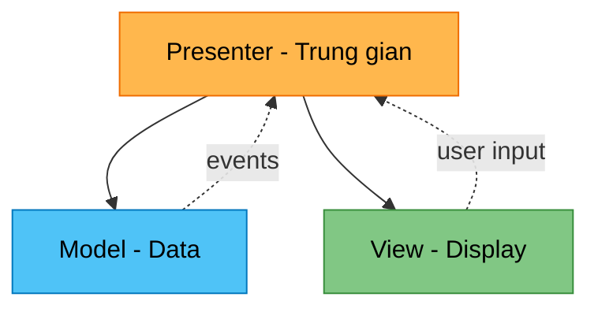

# Module 2: MVP in Unity

> *"The Presenter acts as the middleman between the View and the Model, and all communication between them happens through the Presenter."*

Áp dụng Model-View-Presenter cho Unity game.

---

## Recall Phase 2 & 3 🔙

MVP kết hợp nhiều concepts đã học:

| Phase | Concept | Áp dụng trong MVP |
|-------|---------|-------------------|
| Phase 2 | Program to Abstraction | `IPlayerView` interface |
| Phase 2 | Low Coupling | View không biết Model |
| Phase 3 | Observer | Model events notify Presenter |
| Phase 1 | Interfaces | View interface cho testability |

---

## MVP vs MVC

| Aspect | MVC | MVP |
|--------|-----|-----|
| View | Biết Model | Chỉ biết Presenter |
| Controller/Presenter | Điều phối | Làm trung gian hoàn toàn |
| Data binding | Two-way | One-way (qua Presenter) |
| Testability | Khó test View | Dễ test Presenter |

---

## Cấu trúc MVP



**Quy tắc:**
- View **chỉ biết** Presenter (Program to Abstraction!)
- Model **không biết ai cả** (pure data)
- Presenter **biết cả hai** và làm trung gian

---

## Implementation

### Model (Không đổi — vẫn dùng Observer pattern)

```csharp
public class PlayerModel
{
    public int Health { get; private set; }
    public int MaxHealth { get; }
    public int Score { get; private set; }
    
    // Observer pattern từ Phase 3
    public event Action<int> OnHealthChanged;
    public event Action<int> OnScoreChanged;
    
    public PlayerModel(int maxHealth)
    {
        MaxHealth = maxHealth;
        Health = maxHealth;
    }
    
    public void TakeDamage(int amount)
    {
        Health = Mathf.Max(0, Health - amount);
        OnHealthChanged?.Invoke(Health);
    }
    
    public void Heal(int amount)
    {
        Health = Mathf.Min(MaxHealth, Health + amount);
        OnHealthChanged?.Invoke(Health);
    }
    
    public void AddScore(int amount)
    {
        Score += amount;
        OnScoreChanged?.Invoke(Score);
    }
}
```

### View Interface (Program to Abstraction!)

```csharp
// Interface cho View — Phase 2 principle!
public interface IPlayerView
{
    void UpdateHealth(float normalizedHealth);
    void UpdateScore(int score);
    void ShowDamageEffect();
    void ShowHealEffect();
    
    event Action OnAttackPressed;
    event Action OnHealPressed;
}
```

### View Implementation

```csharp
public class PlayerView : MonoBehaviour, IPlayerView
{
    [SerializeField] private Slider healthBar;
    [SerializeField] private TextMeshProUGUI scoreText;
    [SerializeField] private ParticleSystem damageVFX;
    [SerializeField] private ParticleSystem healVFX;
    [SerializeField] private Button attackButton;
    [SerializeField] private Button healButton;
    
    public event Action OnAttackPressed;
    public event Action OnHealPressed;
    
    private void Awake()
    {
        attackButton.onClick.AddListener(() => OnAttackPressed?.Invoke());
        healButton.onClick.AddListener(() => OnHealPressed?.Invoke());
    }
    
    // View chỉ hiển thị, KHÔNG có logic!
    public void UpdateHealth(float normalizedHealth)
    {
        healthBar.value = normalizedHealth;
    }
    
    public void UpdateScore(int score)
    {
        scoreText.text = $"Score: {score}";
    }
    
    public void ShowDamageEffect()
    {
        damageVFX.Play();
    }
    
    public void ShowHealEffect()
    {
        healVFX.Play();
    }
}
```

### Presenter

```csharp
public class PlayerPresenter : IDisposable
{
    private readonly PlayerModel model;
    private readonly IPlayerView view;  // Interface, không phải concrete class!
    
    public PlayerPresenter(PlayerModel model, IPlayerView view)
    {
        this.model = model;
        this.view = view;
        
        // Subscribe to Model (Observer pattern)
        model.OnHealthChanged += OnHealthChanged;
        model.OnScoreChanged += OnScoreChanged;
        
        // Subscribe to View (Observer pattern)
        view.OnAttackPressed += OnAttackPressed;
        view.OnHealPressed += OnHealPressed;
        
        // Initial state
        UpdateView();
    }
    
    private void OnHealthChanged(int health)
    {
        float normalized = (float)health / model.MaxHealth;
        view.UpdateHealth(normalized);
    }
    
    private void OnScoreChanged(int score)
    {
        view.UpdateScore(score);
    }
    
    private void OnAttackPressed()
    {
        // Game logic here
        model.TakeDamage(10);
        view.ShowDamageEffect();
    }
    
    private void OnHealPressed()
    {
        model.Heal(20);
        view.ShowHealEffect();
    }
    
    private void UpdateView()
    {
        view.UpdateHealth((float)model.Health / model.MaxHealth);
        view.UpdateScore(model.Score);
    }
    
    // Unsubscribe — tránh memory leak (học từ Phase 3 Observer!)
    public void Dispose()
    {
        model.OnHealthChanged -= OnHealthChanged;
        model.OnScoreChanged -= OnScoreChanged;
        view.OnAttackPressed -= OnAttackPressed;
        view.OnHealPressed -= OnHealPressed;
    }
}
```

### Bootstrap (Wiring — như Factory pattern!)

```csharp
public class GameBootstrap : MonoBehaviour
{
    [SerializeField] private PlayerView playerView;
    
    private PlayerModel playerModel;
    private PlayerPresenter playerPresenter;
    
    private void Start()
    {
        // Create Model (Factory-like)
        playerModel = new PlayerModel(100);
        
        // Create Presenter (wires Model and View)
        playerPresenter = new PlayerPresenter(playerModel, playerView);
    }
    
    private void OnDestroy()
    {
        playerPresenter?.Dispose();  // Memory cleanup!
    }
}
```

---

## Lợi ích của MVP

### 1. Testable (vì dùng Interface!)

> [!VIDEO]
> **Learn Unit Testing for MVP/MVC**  
> [Watch on YouTube](../../RESOURCES.md#phase-4-architecture)  
> *MVP giúp tách biệt logic để test dễ dàng mà không cần Unity Editor.*


```csharp
// Mock View để test Presenter — nhờ IPlayerView interface
public class MockPlayerView : IPlayerView
{
    public float LastHealth { get; private set; }
    public int LastScore { get; private set; }
    
    public event Action OnAttackPressed;
    public event Action OnHealPressed;
    
    public void UpdateHealth(float normalized) => LastHealth = normalized;
    public void UpdateScore(int score) => LastScore = score;
    public void ShowDamageEffect() { }
    public void ShowHealEffect() { }
    
    public void SimulateAttack() => OnAttackPressed?.Invoke();
}

// Unit test — không cần Unity!
[Test]
public void AttackReducesHealth()
{
    var model = new PlayerModel(100);
    var mockView = new MockPlayerView();
    var presenter = new PlayerPresenter(model, mockView);
    
    mockView.SimulateAttack();
    
    Assert.AreEqual(90, model.Health);
    Assert.AreEqual(0.9f, mockView.LastHealth);
}
```

### 2. View không có logic

View chỉ:
- Nhận data và hiển thị
- Forward user input lên Presenter

### 3. Model độc lập

Model không biết UI tồn tại → portable.

---

## Thực hành

### Bước 1: Tạo `IPlayerView` interface

### Bước 2: Implement `PlayerView`
- Không có business logic
- Chỉ emit events và update UI

### Bước 3: Tạo `PlayerPresenter`
- Subscribe cả Model và View
- Handle logic ở đây

### Bước 4: Tạo `GameBootstrap`
- Wire mọi thứ lại

---

## Kiểm tra

- ✅ View không import Model
- ✅ Presenter xử lý tất cả logic
- ✅ Có thể test Presenter với MockView
- ✅ Dispose đúng cách (Phase 3 lesson!)

---

## Kiến thức rút ra

| Khái niệm | Liên hệ Phase trước |
|-----------|---------------------|
| IPlayerView interface | **Program to Abstraction** (Phase 2) |
| Model events | **Observer pattern** (Phase 3) |
| View decoupled | **Low Coupling** (Phase 2) |
| Dispose unsubscribe | **Memory leak lesson** (Phase 3) |
| Bootstrap | **Factory-like** (Phase 3) |

---

## Commit

```
feat(architecture): implement MVP pattern
```

Tiếp theo: [Module 3: Reality Check](./Module3_RealityCheck.md)
