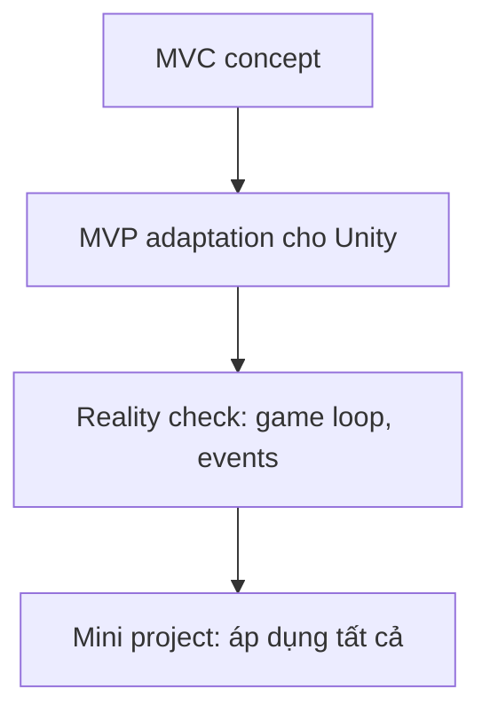

# Phase 4: Architecture

> *"Architecture is about the important stuff. Whatever that is."*  
> — Ralph Johnson

Tổ chức code ở mức project với MVC/MVP.

---

## Bạn đã có nền tảng từ Phase 1-3!

Architecture không phải điều gì mới — nó là **cách kết hợp** tất cả những gì bạn đã học:

| Phase | Bạn đã học | Áp dụng trong Architecture |
|-------|------------|---------------------------|
| **Phase 1** | Encapsulation, Interface, Composition | → **Model classes** (PlayerModel, GameModel) |
| **Phase 2** | Low Coupling, Program to Abstraction | → **MVP separation** (View không biết Model) |
| **Phase 3** | Observer, Factory, State | → **Event-driven architecture** (Model notify View qua events) |

Phase 4 sẽ **wiring** tất cả concepts này vào một project hoàn chỉnh!

---

## Lưu ý quan trọng

### MVC trong game ≠ MVC sách giáo khoa

Unity game **KHÔNG dùng MVC thuần**.

Thường dùng:
- MVP (Model-View-Presenter)
- MVVM (Model-View-ViewModel)
- ECS-ish patterns
- Feature-based architecture

### Tại sao vẫn dạy MVC?

MVC là **gateway concept** — giúp bạn:
- Hiểu tách responsibility
- Có architectural thinking
- Dễ chuyển sang MVP/MVVM sau

---

## Mục tiêu

Sau phase này, bạn sẽ:
- Hiểu tại sao cần architecture
- Biết tách Model-View-Controller/Presenter
- Nhận ra sự khác biệt giữa textbook và production code
- Wiring tất cả kiến thức từ Phase 1-3

👉 Xem [CHECKLIST.md](./CHECKLIST.md) để biết chi tiết những gì cần đạt được.

---

## Các Module

| Module | Nội dung | Thời gian |
|--------|----------|-----------|
| [1. MVC Foundation](./Module1_MVC_Foundation.md) | Hiểu Model-View-Controller | 2-3 giờ |
| [2. MVP in Unity](./Module2_MVP_Unity.md) | Áp dụng MVP cho Unity | 2-3 giờ |
| [3. Reality Check](./Module3_RealityCheck.md) | Game production vs Textbook | 1-2 giờ |
| [4. Mini Project](./Module4_MiniProject.md) | Wiring tất cả Phase 1-3-4 | 4-6 giờ |

---

## Flow học



---

## Kết nối với Phase 3

Phase 3 đã dạy bạn **individual patterns**. Phase 4 dạy cách **kết hợp chúng**:

| Phase 3 Pattern | Phase 4 Application |
|-----------------|---------------------|
| **Observer** | Model → View notification |
| **Factory** | Service creation |
| **State** | Game state management |
| **Strategy** | Multiple AI/Movement in architecture |

---

## Quy tắc

1. Module 4 là capstone project
2. Áp dụng TẤT CẢ kiến thức từ Phase 1-3
3. Commit theo feature, không theo file

---

## Khi hoàn thành

Commit với message:
```
feat(architecture): complete phase 4 with mini project
```

🎉 Chúc mừng! Bạn đã hoàn thành lộ trình.
