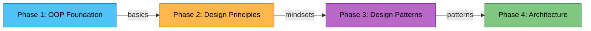

# 🎮 Lộ Trình Tự Học cho Unity Game Dev

> *"The only way to learn programming is by programming."* — Linus Torvalds

Đây là lộ trình **tự học thông qua thực hành**.  
Mỗi phase chứa các tasks với code thực tế.  
**Học qua coding** - và thông qua tự tìm hiểu.

---

## 📚 Sách/Web Tham Khảo Offical

| Sách | Mô tả | Sử dụng khi |
|------|-------|-------------|
| **[Head First Design Patterns](./Books/)** | Sách chính, giải thích patterns qua câu chuyện và hình ảnh | Phase 1-3 |
| **[Game Programming Patterns](./Books/)** | Patterns đặc thù cho Game Dev | Phase 3-4 |

| Web | Mô tả | Sử dụng khi |
|------|-------|-------------|
| **[Game Programming Patterns](./RESOURCES.md#game-context--references)** | Cho bạn thích đọc web cho tiện và dùng tool dịch dễ hơn| Phase 3-4 |

> [!TIP]
> Sách nằm trong folder `Books/`. Đọc **khi stuck**, không phải đọc trước.

---

## 🗺️ Lộ Trình Học



---

## 📋 Chi Tiết Từng Phase

### Phase 1: OOP Foundation 🔨
> **Nguồn tham khảo chính:** Head First Design Patterns (Chapter 1: SimUDuck)

| Module | Nội dung | Sách tham khảo |
|--------|----------|----------------|
| Module 1: Modeling | Class, State, Behavior | HFDP Ch.1 |
| Module 2: Variation | Inheritance, Interface | HFDP Ch.1 |
| Module 3: Dependency | Coupling, Events | HFDP Ch.1 |

**Bạn sẽ học:**
- Nghĩ theo objects (không phải functions)
- Nhận ra vấn đề của inheritance
- Hiểu coupling là gì

**Lưu ý**: Game Context chỉ là để bài mẫu, các bạn có thể tự sáng tạo hoặc chỉnh sửa theo sở thích cá nhân, miễn là nó vẫn sẽ gồm các thành phần như vậy.

👉 **[Bắt đầu Phase 1](./Phase1_OOP_Foundation/README.md)**

---

### Phase 2: Design Principles 💡
> **Nguồn tham khảo chính:** Head First Design Patterns (Design Principles)

| Principle | Nội dung | SOLID liên quan |
|-----------|----------|-----------------|
| Encapsulate What Varies | Tách phần hay thay đổi | Open/Closed |
| Composition Over Inheritance | HAS-A > IS-A | Liskov, ISP |
| Program to Interfaces | Phụ thuộc abstraction | DIP |
| Low Coupling, High Cohesion | Objects ít biết về nhau | SRP |

**Bạn sẽ học:**
- 4 mindsets cốt lõi của OOP design
- SOLID qua góc nhìn thực tế
- Chuẩn bị cho Design Patterns

👉 **[Bắt đầu Phase 2](./Phase2_Design_Principles/README.md)**

---

### Phase 3: Design Patterns 🧩
> **Nguồn tham khảo chính:** Head First Design Patterns + Game Programming Patterns

| Pattern | Vấn đề giải quyết | Sách tham khảo |
|---------|-------------------|----------------|
| Strategy | Thay đổi behavior runtime | HFDP Ch.1 |
| Observer | Notify nhiều objects | HFDP Ch.2, GPP |
| Object Pool | Tránh GC, tối ưu spawn | GPP |
| Factory | Tạo objects linh hoạt | HFDP Ch.4 |
| State | Quản lý trạng thái | HFDP Ch.10, GPP |
| Command | Undo, replay, input | HFDP Ch.6, GPP |
| Singleton | Global access (⚠️ cẩn thận!) | HFDP Ch.5, GPP |

**Bạn sẽ học:**
- 7 patterns quan trọng nhất cho Game Dev
- Khi nào dùng và KHÔNG nên dùng
- Cách kết hợp patterns

👉 **[Bắt đầu Phase 3](./Phase3_Design_Patterns/README.md)**

---

### Phase 4: Architecture 🏗️
> **Nguồn tham khảo chính:** Game Programming Patterns (Architecture section)

| Module | Nội dung | Kết hợp patterns |
|--------|----------|------------------|
| MVC Foundation | Model-View-Controller concepts | - |
| MVP in Unity | Áp dụng thực tế cho Unity | Observer |
| Reality Check | Production vs Textbook | All |
| Mini Project | Wiring tất cả kiến thức | All Phase 1-3 |

**Bạn sẽ học:**
- Tổ chức code ở mức project
- MVC/MVP trong context Unity
- Áp dụng TẤT CẢ kiến thức Phase 1-3

👉 **[Bắt đầu Phase 4](./Phase4_Architecture/README.md)**

---

## 📝 Quy Tắc Commit

Sau mỗi milestone, commit theo format:

```
feat(phase): nội dung ngắn gọn
```

**Ví dụ:**
- `feat(oop): complete basic modeling`
- `feat(principles): implement encapsulate what varies`
- `feat(patterns): implement strategy pattern`
- `feat(architecture): complete MVP module`

---

## 🆘 Khi Bị Stuck

### Quy trình xử lý (theo thứ tự):

1. **Đọc lại task** — Có thể bạn hiểu sai requirement
2. **Debug code** — Dùng Debug.Log, breakpoints
3. **Tìm Google** — Stack Overflow, Unity Forums
4. **Đọc sách** — Xem `Books/` folder
5. **Xem RESOURCES.md** — Video tutorials được gợi ý

> [!WARNING]
> **Không được stuck quá 2 giờ cho một vấn đề!**  
> Nếu vẫn stuck, ghi lại vấn đề và chuyển sang phần khác.

---

## 🎯 Bắt Đầu

Đã sẵn sàng? 

👉 **[Vào Phase 1: OOP Foundation](./Phase1_OOP_Foundation/README.md)**

---

## 📂 Cấu Trúc Project

```
MyMuse/
├── README.md                    ← Bạn đang ở đây
├── RESOURCES.md                 ← Tài liệu tham khảo
├── Books/                       ← Sách PDF
│   ├── Head First Design Patterns.pdf
│   └── Game Programming Patterns.pdf
├── Phase1_OOP_Foundation/       ← OOP cơ bản
│   ├── README.md
│   ├── CHECKLIST.md
│   ├── Module1_Modeling/
│   ├── Module2_Variation/
│   └── Module3_Dependency/
├── Phase2_Design_Principles/    ← Nguyên tắc thiết kế
│   ├── README.md
│   ├── CHECKLIST.md
│   └── Principle1-4.md
├── Phase3_Design_Patterns/      ← Design patterns
│   ├── README.md
│   ├── CHECKLIST.md
│   └── Pattern1-7.md
└── Phase4_Architecture/         ← Kiến trúc
    ├── README.md
    ├── CHECKLIST.md
    └── Module1-4.md
```

---

*Last updated: 2026-02-09*
